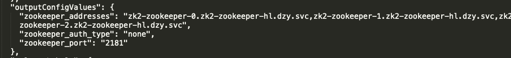

# 目录

- [产品(应用群管理)](#产品(应用群管理))
  - [1. 安装产品](#1-安装产品)
  - [2. 删除产品](#2-删除产品)
  - [3. 添加应用到产品](#3-添加应用到产品)
  - [4. 升级产品里的应用](#4-升级产品里的应用)
  - [5. 移除产品里的应用](#5-移除产品里的应用)
  - [6. 自动构建产品应用之间的依赖关系](#6-自动依赖产品应用之间的关系)


# 产品(应用群管理)

产品包含一个或多个应用， 各个应用之间可以通过依赖关系构建成应用群， project接口支持产品的安装，删除，应用的添加，升级，移除以及依赖关系的自动构建。

## 1. 安装产品

在创建 `project` 过程中：

- 支持一次性安装一个或多个`release`到 `project`中。 
- 支持`releases`列表中的 `release`公用配置 `commonConfig`， 其值会和每个组件的`configValues`进行合并， 用于工作量简化。 值得注意的是， 合并过程中，`configValues`的优先级高于`commonConfig`， 即 `configValues`不存在`commonValues`对应的字段时， 属性以 `commonValues` 为主， 反之， 则以 `configValues`中值为主， 因为我们可以得出结论， 应用配置时， 优先级 `metainfoParams` >`configValues` > `commonValues`。 

- 安装产品时不指定`dependencies`的前提下可根据 `yaml`自动构建依赖
- 支持手动指定 `dependencies`构建依赖， 手动构建依赖时， 此前与该应用相关的自动依赖构建实效， 依赖构建以 `dependencies`中的应用为主。

```

{
  "commonValues": {},
  "releases": [
    {
      "chartImage": "string",
      "chartName": "string",
      "chartVersion": "string",
      "configValues": {},
      "dependencies": {},
      "metaInfoParams": {
      },
      "name": "string",
      "plugins": [
        {
          "args": "string",
          "disable": true,
          "name": "string",
          "version": "string"
        }
      ],
      "releaseLabels": {},
      "repoName": "string"
    }
  ]
}
```

安装一个产品名为 `demo`， 同时安装zookeeper和kafka,  kafka依赖该zookeeper。

```json
{
  "commonValues": {},
  "releases": [
    {
      "chartName": "zookeeper",
      "chartVersion": "6.1.0",
      "configValues": {
        "appConfig": {
          "zookeeper": {
            "replicas": 3
          }
        }
      },
      "name": "zk2",
      "repoName": "qa"
    },
    {
      "chartName": "kafka",
      "chartVersion": "6.1.0",
      "name": "ka2",
      "repoName": "qa"
    }
  ]
}
```

安装结果如下，由于`kafka` 的 chart中定义了需要对`zookeeper`进行依赖， 所以当`zookeeper`和`kafka`处于同一个`project`中时吗会自动构建依赖。其中， `zookeeper`以`outputConfigValues`对外暴露自己的服务地址，端口以及验证类型，而`kafka`的`dependenciesConfigValues`中定义了所依赖的`zookeeper`客户端的配置。 

<div>
    
</div>

<div>
    
</div>

## 2. 删除产品

删除产品中的所有的应用,通过接口`DELETE /api/v1/project/{namespace}/name/{project}`来完成。

支持同步或异步删除，设置任务超时时间，以及删除Project Releases管理的statefulSet关联的所有pvc。

## 3. 添加应用到产品

```
// 向demo项目中重新添加kafka应用
{
  "commonValues": {},
  "releases": [
    {
      "chartName": "kafka",
      "chartVersion": "6.1.0",
      "name": "ka2",
      "repoName": "qa",
      "dependencies": {
        "zookeeper": "zk2"
      }
    }
  ]
}
```

## 4. 升级产品里的应用

升级产品里的应用， 使用方法同升级Release[见文档《基于Helm的应用管理》](application-management.md)。 

## 5. 移除产品里的应用

支持删除产品的时候同时删除 release管理的statefulset关联的所有pvc。

eg: 删除之前安装的kafka。

<div>
    
</div>


## 6. 自动构建产品应用之间的依赖关系

在同一个项目中， 如果已经安装了一个zookeeper应用，添加产品组件kafka后， 即使不在dependencies进行依赖设置，默认情况下会构建kafka应用和zookeeper应用之间的动态关系。具体如下:
1. 查看kafka chart的 metainfo.yaml中dependencies字段信息,具体如下:

```shell script
dependencies:
- name: zookeeper
  type: single
  chartName: zookeeper
  minVersion: "6.0"
  maxVersion: "6.2"
  dependencyOptional: true
  aliasConfigVar: ZOOKEEPER_CLIENT_CONFIG

#其中，如果name为空,则该项依赖无效。如果name 不为空，chartName为空，该项依赖有效。
#若name不为空，chartName不为空,name与chartName相同,依赖有效, name与chartName不相同，依赖无效,
#我们将这些有效依赖的name都放入列表A中。

#对于列表A中的依赖（每个依赖都表示一个应用）来说，如果该项目中已经存在chartName和A列表中name相同的应用（如zookeeper,
#并且没有对kafka手动设置key和A列表中name相同的依赖（即没有在 ReleaseRequest中的dependencies中添加key为name的依赖）
#,那么系统会自动构建 kafka 和 chartName为 name的 应用之间的依赖关系。

```

- 支持应用的动态依赖

  eg:项目上已经存在了一个运行良好的zookeeper应用, `name`为`zk2`，现在需要安装一个kafka应用，依赖这个已经存在的 zookeeper应用。 

```yaml
// 1. 调用/api/v1/project/{namespace}/name/{project}/instance接口添加一个kafka组件
{
	"chartName": "kafka",
	"chartVersion": "6.1.0",
	"name": "ka2",
	"repoName": "qa",
	"dependencies": {
	"zookeeper": "zk2"
	}
}
// 2.  kafka 组件安装成功后， 可以查看其release信息， 看到kafka依赖的配置
"dependenciesConfigValues": {
  "ZOOKEEPER_CLIENT_CONFIG": {
   "zookeeper_addresses": "zk2-zookeeper-0.zk2-zookeeper-hl.helmv3.svc,zk2-zookeeper-1.zk2-zookeeper-hl.helmv3.svc,zk2-zookeeper-2.zk2-zookeeper-hl.helmv3.svc",
   "zookeeper_auth_type": "none",
   "zookeeper_port": "2181"
  }
 }
```

- 支持实时感知依赖配置变化并重新注入

  eg: k8s集群上已经存在了一个运行良好的zookeeper集群 + kafka集群。当zookeeper集群配置更新后，比如扩容后，kafka集群需要实时感知到zookeeper配置的变化， 注入新的配置并实时生效。

```yaml
//1. 升级zookeeper组件， 进行扩容后
 {
      "chartName": "zookeeper",
      "chartVersion": "6.1.0",
      "configValues": {
        "appConfig": {
          "zookeeper": {
            "replicas": 5
          }
        }
      },
      "name": "zk2",
      "repoName": "qa"
}
//2.查询kafka配置， 发现kafka感知到依赖变化
 "dependenciesConfigValues": {
  "ZOOKEEPER_CLIENT_CONFIG": {
   "zookeeper_addresses": "zk2-zookeeper-0.zk2-zookeeper-hl.helmv3.svc,zk2-zookeeper-1.zk2-zookeeper-hl.helmv3.svc,zk2-zookeeper-2.zk2-zookeeper-hl.helmv3.svc,zk2-zookeeper-3.zk2-zookeeper-hl.helmv3.svc,zk2-zookeeper-4.zk2-zookeeper-hl.helmv3.svc",
   "zookeeper_auth_type": "none",
   "zookeeper_port": "2181"
  }
 }
```


