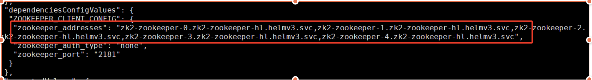

##1.准备工作

### 在kubernetes上部署walm

- [Run Walm On Linux Clusters](run-walm-on-linux-clusters.md)
- [Run Walm On Google Kubernetes Engine Clusters](run-walm-on-google-kubernetes-engine-clusters.md)

##2.开始部署应用

###[使用Rook部署Ceph系统并提供PV服务](http://www.yangguanjun.com/2018/12/22/rook-ceph-practice-part1/)

⚠️如果使用Rook提供pv服务，安装zookeeper应用前请确保chart中 storageClassName的值为 `rook-ceph-block`

###安装 zookeeper

Walm支持rest api来管理应用程序的生命周期。在https://server_host:31607/swagger-ui中选择通过使用本地chart安装一个release，填写对应的`租户名字`和`release名字`， 并且上传chart后， 我们可以在`body`中对应用进行自定义配置， 具体参照[如何用walm安装一个应用](applications-management.md)：

- 通过metainfoParams, configValues 对原应用配置进行重写
- 通过releaseLabels实现标签的添加和删除
- 通过 plugins 实现插件的添加和删除
- 通过 dependencies 手动设置依赖
- 更新chart信息
- …...

```json
{
  "chartName": "zookeeper",
  "chartVersion": "6.1.0",
  "configValues": {},
  "metaInfoParams": {
    "params": [],
    "roles": [
      {
        "baseConfig": {
          "env": [],
          "image": "docker.io/warpcloud/zookeeper:5.2",
          "others": [
            {
              "name": "string",
              "type": "string",
              "value": {}
            }
          ],
          "priority": 0,
          "replicas": 3,
          "useHostNetwork": false
        },
        "name": "zookeeper",
        "resources": {
          "limitsCpu": 2,
          "limitsMemory": 4,
          "requestsCpu": 0.5,
          "requestsMemory": 1,
          "storageResources": [
            {
              "name": "data",
              "value": {
                "accessModes": [
                  "ReadWriteOnce"
                ],
                "size": 100,
                "storageClass": "silver"
              }
            }
          ]
        }
      }
    ]
  },
  "name": "zk2",
  "releaseLabels": {},
  "repoName": "stable",
  "dependencies": {},
  "plugins": [],
}
```

在安装应用前，可以通过`POST /api/v1/release/{namespace}/dryrun/resources`接口模拟安装Release所需要的资源，以及`POST /api/v1/release/{namespace}/dryrun/withchart`模拟Release的安装， 对集群资源进行合理规划和安排。

```
POST /api/v1/release/{namespace}/dryrun/withchart/resources
namespace: test
release: zookeeper-dzy
chart: zookeeper-5.2.0.tar.gz
Response Body
{
  "deployments": null,
  "statefulSets": [
    {
      "replicas": 1,
      "name": "zookeeper-dzy-zookeeper",
      "podRequests": {
        "cpu": 0.5,
        "memory": 512,
        "storage": [
          {
            "name": "zkdir",
            "type": "pvc",
            "storageClass": "silver",
            "size": 100
          }
        ]
      },
      "podLimits": {
        "cpu": 0.5,
        "memory": 512,
        "storage": null
      }
    }
  ],
  "daemonSets": null,
  "jobs": null,
  "pvcs": null
}
```

**walm相较于helm， 支持检索更加详细的应用程序规范和状态**。 应用安装成功后， 可以通过`GET /api/v1/release/{namespace}/name/{release}`接口获取所安装的release信息，例如是否Ready， 没有Ready的原因， 应用的所有的kubernetes资源的状态， 动态依赖信息，应用的各项资源配置等

```
{
  "name": "zk2",
  "repoName": "",
  "configValues": {
    "advanceConfig": {
      "zoo_cfg": {
        "autopurge.purgeInterval": 5,
        "autopurge.snapRetainCount": 10,
        "initLimit": 10,
        "maxClientCnxns": 0,
        "syncLimit": 5,
        "tickTime": 9000
      },
      "zookeeper": {
        "zookeeper.client.port": 2181,
        "zookeeper.jmxremote.port": 9911,
        "zookeeper.leader.elect.port": 3888,
        "zookeeper.peer.communicate.port": 2888
      }
    },
    "appConfig": {
      "zookeeper": {
        "env_list": [],
        "image": "docker.io/warpcloud/zookeeper:5.2",
        "priority": 0,
        "replicas": 3,
        "resources": {
          "cpu_limit": 2,
          "cpu_request": 0.5,
          "memory_limit": "4Gi",
          "memory_request": "1Gi",
          "storage": {
            "data": {
              "accessMode": "ReadWriteOnce",
              "limit": {},
              "size": "100Gi",
              "storageClass": "rook-ceph-block"
            }
          }
        },
        "use_host_network": false
      }
    },
    "transwarpConfig": {
      "transwarpApplicationPause": false,
      "transwarpCniNetwork": "overlay",
      "transwarpGlobalIngress": {
        "httpPort": 80,
        "httpsPort": 443
      },
      "transwarpLicenseAddress": "",
      "transwarpMetrics": {
        "enable": true
      }
    }
  },
  "version": 1,
  "namespace": "default",
  "dependencies": {},
  "chartName": "zookeeper",
  "chartVersion": "6.1.0",
  "chartAppVersion": "6.1",
  "ready": true,
  "message": "",
  "releaseStatus": {
    "services": [],
    "configmaps": [],
    "daemonsets": [],
    "deployments": [],
    "ingresses": [],
    "jobs": [],
    "secrets": [],
    "statefulsets": []
  },
  "dependenciesConfigValues": {},
  "computedValues": {
    "advanceConfig": {
      "zoo_cfg": {
        "autopurge.purgeInterval": 5,
        "autopurge.snapRetainCount": 10,
        "initLimit": 10,
        "maxClientCnxns": 0,
        "syncLimit": 5,
        "tickTime": 9000
      },
      "zookeeper": {
        "zookeeper.client.port": 2181,
        "zookeeper.jmxremote.port": 9911,
        "zookeeper.leader.elect.port": 3888,
        "zookeeper.peer.communicate.port": 2888
      }
    },
    "appConfig": {
      "zookeeper": {
        "env_list": [],
        "image": "docker.io/warpcloud/zookeeper:5.2",
        "priority": 0,
        "replicas": 3,
        "resources": {
          "cpu_limit": 2,
          "cpu_request": 0.5,
          "memory_limit": "4Gi",
          "memory_request": "1Gi",
          "storage": {
            "data": {
              "accessMode": "ReadWriteOnce",
              "limit": {},
              "size": "100Gi",
              "storageClass": "rook-ceph-block"
            }
          }
        },
        "use_host_network": false
      }
    },
    "transwarpConfig": {
      "transwarpApplicationPause": false,
      "transwarpCniNetwork": "overlay",
      "transwarpGlobalIngress": {
        "httpPort": 80,
        "httpsPort": 443
      },
      "transwarpLicenseAddress": "",
      "transwarpMetrics": {
        "enable": true
      }
    }
  },
  "outputConfigValues": {},
  "releaseLabels": {},
  "plugins": [],
  "metaInfoValues": {
    "params": [
      {
        "name": "zoo_cfg",
        "type": "kvPair",
        "value": "{\"autopurge.purgeInterval\":5,\"autopurge.snapRetainCount\":10,\"initLimit\":10,\"maxClientCnxns\":0,\"syncLimit\":5,\"tickTime\":9000}"
      },
      {
        "name": "zookeeper",
        "type": "kvPair",
        "value": "{\"zookeeper.client.port\":2181,\"zookeeper.jmxremote.port\":9911,\"zookeeper.leader.elect.port\":3888,\"zookeeper.peer.communicate.port\":2888}"
      }
    ],
    "roles": [
      {
        "name": "zookeeper",
        "baseConfig": {
          "image": "docker.io/warpcloud/zookeeper:5.2",
          "priority": 0,
          "replicas": 3,
          "env": [],
          "useHostNetwork": false,
          "others": null
        },
        "resources": {
          "limitsMemory": 4096,
          "limitsCpu": 2,
          "limitsGpu": 0,
          "requestsMemory": 1024,
          "requestsCpu": 0.5,
          "requestsGpu": 0,
          "storageResources": [
            {
              "name": "data",
              "value": {
                "accessModes": null,
                "storageClass": "rook-ceph-block",
                "size": 100
              }
            }
          ]
        }
      }
    ],
    "customParams": null
  },
  "paused": false,
  "chartImage": ""
}
```

### 安装 kafka 集群

通过本地chart安装一个kafka集群，安装方式同上，我们选择使其依赖已存在的zookeeper集群

```
{
  "name": "ka2",
  "dependencies": {
     "zookeeper": "zk2"
  }
}
```

Walm动态管理应用的依赖关系。应用可以依赖已存在的应用，可以自动或手动注入依赖的应用的配置。此外，一旦应的配置发生变化，配置将再次实时注入。

查看kafka的应用信息， 我们可以看到kafka依赖已经存在的zookeeper集群， 并且可以看到依赖的配置。

<div>
    
</div>

我们对zookeeper进行扩容， 通过`PUT /api/v1/release/{namespace}`接口对 zk2 进行升级, 将replicas的数目从3个扩5个。

```json
{
  "name": "zk2",
  "configValues": {
     "appConfig": {
        "zookeeper": {
           "replicas": 5
        }
     }
  },
}
```

zookeeper升级成功后， 我们再次查看kafka的应用的详细信息， 发现kafka集群自动感知到了zookeeper集群的变化

<div>
    
</div>