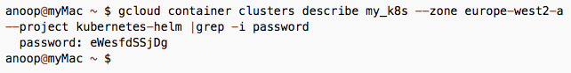
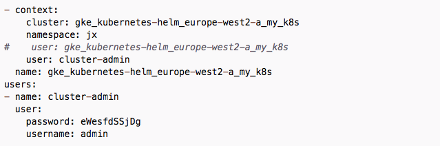
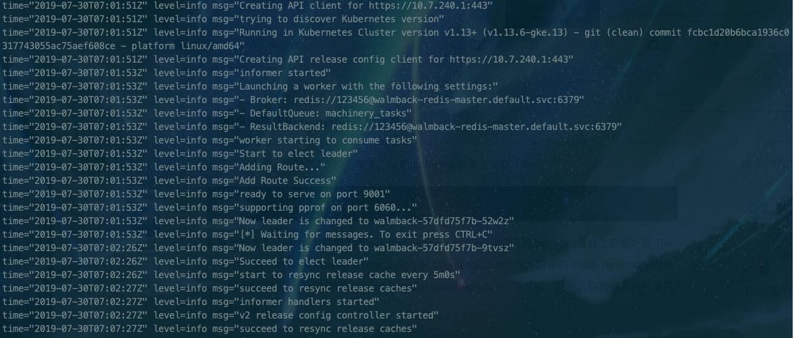
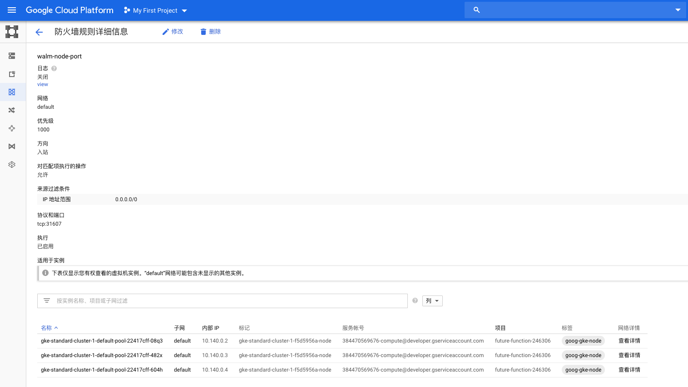
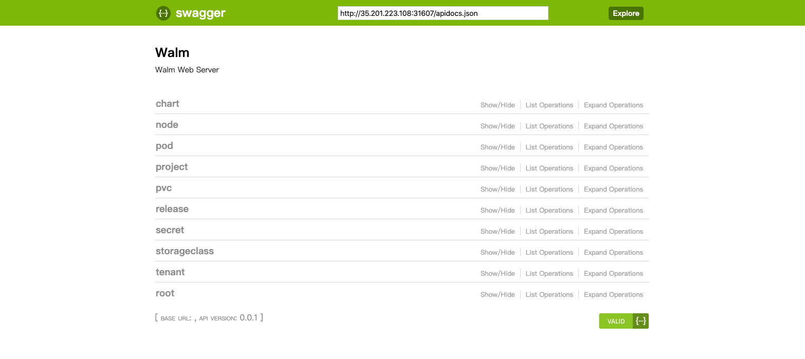

# 目录

* [Deploying walm on google kubernetes engine](#Deploying walm on google kubernetes engine)
    * [1. Prerequisites](#1-Prerequisites)
    * [2. Config helm](#2-Config helm)
    * [3. Deploying Redis](#3-Deploying Redis)
    * [4. Deploying walm](#4-Deploying walm)

# Deploying walm on google kubernetes engine

这是一个快速开始的操作指南，用于在 [Google Kubernetes Engine](https://cloud.google.com/kubernetes-engine/)（GKE）上使用安装并运行 [walm]()。

## 1. Prerequisites

- 该用例需要一个启用了支付功能的有效的 Google Cloud Platform 项目。如果读者现在还不是 GCP 用户，可以现在加入，能够获得 [300 美元](https://cloud.google.com/free/) 的的充值点数用于试用。
- 参考[快速入门](https://cloud.google.com/kubernetes-engine/docs/quickstart?hl=zh-cn),  完成gke集群的创建。
- 下载[gcloud](https://cloud.google.com/sdk/gcloud/), 参考[为kubectl配置集群访问权限](https://cloud.google.com/kubernetes-engine/docs/how-to/cluster-access-for-kubectl?hl=zh-cn),  通过`kubectl`对远程gke资源进行访问。
- 教程中所需要的`redis`和`walm`的chart， 参见[官方仓库](https://github.com/WarpCloud/walm-charts)。
- 若需要自动创建pv， 请参考[Dynamically provision GKE Reference](https://cloud.google.com/community/tutorials/gke-filestore-dynamic-provisioning)。

## 2. Config helm

教程中使用的工具版本，仅供参考：

| Entity                 | Version        |
| ---------------------- | -------------- |
| kubectl client         | 1.11.1         |
| helm client            | 2.14.1         |
| GKE kubernetes version | v1.13.6-gke.13 |

###Create service account for helm

首先创建一个服务帐户并将群集管理角色附加到该帐户。这使得tiler pod可以与kubernetes API通信。

```yaml
# This is an extract from here: http://jayunit100.blogspot.fi/2017/07/helm-on.html
# create-helm-service-account.yaml
apiVersion: v1
kind: ServiceAccount
metadata:
  name: helm
  namespace: kube-system
---
apiVersion: rbac.authorization.k8s.io/v1beta1
kind: ClusterRoleBinding
metadata:
  name: helm
roleRef:
  apiGroup: rbac.authorization.k8s.io
  kind: ClusterRole
  name: cluster-admin
subjects:
  - kind: ServiceAccount
    name: helm
    namespace: kube-system
```

```bash
$ kubectl apply -f create-helm-service-account.yaml
serviceaccount/helm created
clusterrolebinding.rbac.authorization.k8s.io/helm created
```

### Elevate privileges for creating ClusterRoleBindings (if necessary)

**如果上述命令成功，则跳过该步骤。**有时对`gke`集群进行操作时会出现 `forbidden errors`， 此时可以通过作为特权用户执行 ClusterRoleBinding 解决这一问题。

- 通过 `gcloud describe` 获取admin password



- 使用证书来创建和之前部分的`service account`和`cluster role binding`,  一种方法是修改 `$HOME/.kube/config`， 添加一个新的用户并将其提供给你的上下文， 然后在 `helm init` 时恢复。



### Initialise helm

运行`helm init`传递`service account`。

```shell
$ helm init --service-account helm
```

### Verify helm

```shell
$ helm create samplechart
Creating samplechart
$ helm install --name helm-test ./samplechart --set service.type=LoadBalancer
NAME:   helm-test
LAST DEPLOYED: Mon Jul 29 14:00:39 2019
NAMESPACE: default
STATUS: DEPLOYED

RESOURCES:
==> v1/Deployment
NAME                   READY  UP-TO-DATE  AVAILABLE  AGE
helm-test-samplechart  0/1    1           0          1s

==> v1/Pod(related)
NAME                                    READY  STATUS             RESTARTS  AGE
helm-test-samplechart-678d9f66f5-5wfhg  0/1    ContainerCreating  0         1s

==> v1/Service
NAME                   TYPE          CLUSTER-IP   EXTERNAL-IP  PORT(S)       AGE
helm-test-samplechart  LoadBalancer  10.7.252.85  <pending>    80:31118/TCP  1s
$ kubectl get svc
NAME                    TYPE           CLUSTER-IP    EXTERNAL-IP       PORT(S)        AGE
helm-test-samplechart   LoadBalancer   10.7.252.85   104.199.145.204   80:31118/TCP   60s
kubernetes              ClusterIP      10.7.240.1    <none>            443/TCP        18d
```


# 3. Deploying Redis

### Create persistentVolume && persistentVolumeClaim for redis

:warning:此处使用hostpath实现存储， 也可采用其他方式， 请同步更改 redis chart中 values.yaml的`storageClassName`的值。

```yaml
## redis-pv.yaml
kind: PersistentVolume
apiVersion: v1
metadata:
  name: redis-data-walm-redis-master-0
  labels:
    type: local
spec:
  storageClassName: hostpath
  capacity:
    storage: 8Gi
  accessModes:
    - ReadWriteOnce
  hostPath:
    path: "/tmp/redis"
---
kind: PersistentVolumeClaim
apiVersion: v1
metadata:
  name: redis-data-walm-redis-master-0
spec:
  storageClassName: hostpath
  accessModes:
    - ReadWriteOnce
  resources:
    requests:
      storage: 8Gi
```

```shell
$ kubectl apply -f redis-pv.yaml
```

### Create redis

创建 redis服务

```shell
$ helm install -n namespace --name walm-redis ./redis
```

当redis 正常运行时

```shell
$ kubectl -n kube-system get svc
NAME                   TYPE        CLUSTER-IP     EXTERNAL-IP   PORT(S)          AGE
walm-redis-master      ClusterIP   10.7.246.210   <none>        6379/TCP         40h
$ kubectl -n kube-system get pods
NAME                    READY     STATUS    RESTARTS   AGE
walm-redis-master-0     1/1       Running   0          20h
```

对 redis 密码进行验证

```shell
$ kubectl -n kube-system exec -it walm-redis-master-0 /bin/bash
root@walm-redis-master-0:/data# redis-cli
127.0.0.1:6379> Auth 123456
OK
```

## 4. Deploying walm

在部署`walm`之前，需要对`walm`的 values.yaml 进行如下配置：

- repoList 当中自行配置chartRepo的名称和地址, walm可以直接使用 `chartRepo`里的chart来安装应用。

chartmuseum安装请参考[chartmuseum安装](run-walm-on-linux-clusters.md)对应部分

```shell
repoList:
  - name: chartmuseum
    url: http://127.0.0.1:8088
  - name: stable
    url: https://kubernetes.oss-cn-hangzhou.aliyuncs.com/charts
```

- 需要自行配置`redisConfig`， 包含redis服务的`host`, `port`, `password`, `db`等

```shell
$ kubectl get svc -n default
NAME                    TYPE           CLUSTER-IP     EXTERNAL-IP       PORT(S)          AGE
walm-redis-master     ClusterIP      10.7.254.5     <none>            6379/TCP         3h53m

## host: walm-redis-master.default.svc
```

- 可以自定义配置 walm服务的nodePort， 默认 31607
- 根据自身集群的规模合理定义walm resource的大小

部署`walm`

```shell
$ helm install --name walm ./walm
```

walm 部署成功后，查看 walm状态

```shell
$ kubectl get po,svc,replicaset
NAME                                         READY     STATUS    RESTARTS   AGE
pod/walm-57dfd75f7b-9tvsz                    1/1       Running   0          21m

NAME                        TYPE           CLUSTER-IP     EXTERNAL-IP       PORT(S)      
AGE
service/walm                NodePort       10.7.253.188   <none>            9001:31607/TCP   21m
service/walm-hl             ClusterIP      None           <none>            9001/TCP         21m

NAME                                                 DESIRED   CURRENT   READY     AGE
replicaset.extensions/walm-57dfd75f7b                1         1         1         21m
```

通过`kubectl -n default logs -f walm-57dfd75f7b-9tvsz`查看 walm的日志

<div>
    
</div>

环境变量设置

```shell
$ export HELM_DRIVER=configmap && helm ls
```

虽然walm属于running状态， 但目前还是无法访问的， 需要创建防火墙规则以允许TCP流量进入节点端口。[参考](https://cloud.google.com/kubernetes-engine/docs/how-to/exposing-apps?hl=zh-cn)

首先我们查看集群中节点的外部ip地址：

```shell
$ kubectl get nodes --output wide
NAME     STATUS    ROLES     AGE       VERSION          INTERNAL-IP   EXTERNAL-IP       OS-IMAGE    KERNEL-VERSION   CONTAINER-RUNTIME
gke-standard-cluster-1-default-pool-22417cff-08q3   Ready     <none>    2d3h      v1.13.6-gke.13   10.140.0.2    35.201.223.108    Container-Optimized OS from Google   4.14.127+        docker://18.9.3
gke-standard-cluster-1-default-pool-22417cff-482x   Ready     <none>    2d3h      v1.13.6-gke.13   10.140.0.3    104.199.225.254   Container-Optimized OS from Google   4.14.127+        docker://18.9.3
gke-standard-cluster-1-default-pool-22417cff-604h   Ready     <none>    2d3h      v1.13.6-gke.13   10.140.0.4    34.80.131.56      Container-Optimized OS from Google   4.14.127+        docker://18.9.3
```

通过`kubectl describe node `我们发现 `walm-56c4b49bb6-8994h`部署在 外部ip地址为 `35.201.223.108`的节点上。我们记下这个ip地址。

通过`kubectl -n kube-system get svc walm -o yaml` 我们可以查看到walm服务的 nodePort为 31607，该端口为我们访问walm服务的端口。

创建一条防火墙规则以允许 TCP 流量进入节点端口：

方法一：

确保你已安装[Cloud SDK](https://cloud.google.com/sdk/downloads?hl=zh-cn)。

打开[控制台](https://console.cloud.google.com)， 点击右上角的 cloud shell 按钮，连接到google cloud shell 机器。

```shell
gcloud compute firewall-rules create walm-node-port --allow tcp:31607
```

方法二：

打开 [防火墙设置页面](https://console.cloud.google.com/networking/firewalls/),点击**创建防火墙规则**

<div>
    
</div>

浏览器打开 http://35.201.223.108:31607/swagger-ui/ 访问walm server。

<div>
    
</div>